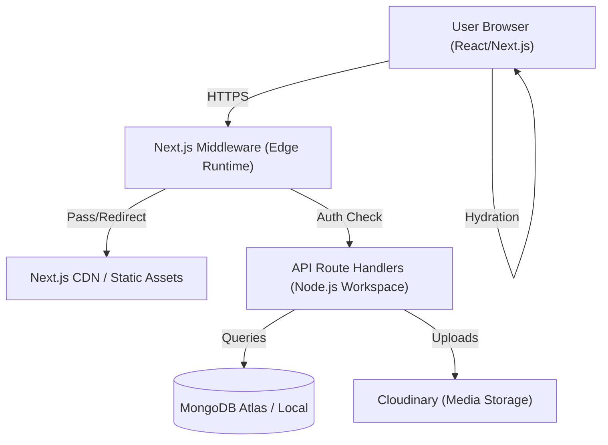
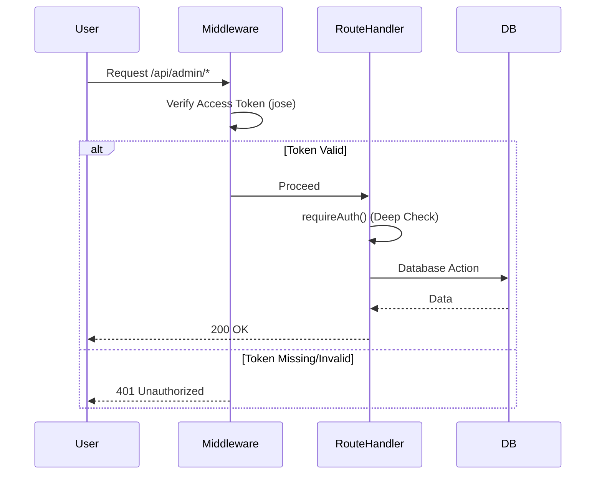

# Portfolio System Architecture Design

This document provides a detailed technical overview of the portfolio system's architecture, data flow, and security model.

## 1. System Overview

The application is built using a modern **Next.js 15 Full-Stack** architecture, leveraging the **App Router** for both frontend rendering and backend API logic. The system is designed for high performance, SEO optimization, and secure content management.

### Logical Architecture

---

## 2. Frontend Architecture

### Component Pattern
The UI follows an **Atomic Design** philosophy adapted for Next.js:
- **UI Primitives (`components/ui/`)**: Pure, reusable atoms like Buttons, Icons, and Containers.
- **Sections (`components/sections/`)**: Higher-order modules that form page blocks (Hero, About, Contact).
- **Layouts (`app/layout.tsx`)**: Global wrappers managing stateful components (Navbar, Footer, Providers).

### Styling & Animation
- **Tailwind CSS 4**: Utilizes the latest utility-first CSS framework for rapid UI development and small bundle sizes.
- **Framer Motion**: Orchestrates complex animations (FadeIn, Scale, Stagger) via a centralized animation library (`lib/animations.ts`).

---

## 3. Backend Architecture

### API Layer
Located in `app/api/`, using Next.js Route Handlers.
- **Public Routes**: Read-only access to blog posts, projects, and profile data.
- **Admin Routes**: Protected CRUD operations for portfolio management.
- **Audit Logging**: Every write operation (POST, PUT, DELETE) is intercepted and logged via `lib/utils/audit-logger.ts`.

### Service & Data Layer
- **Mongoose ODM**: Manages database schemas and validation.
- **Connection Pooling**: Implements a cached connection pattern to prevent MongoDB connection exhaustion during high-concurrency API calls or local hot-reloads.

---

## 4. Security Model

### Authentication Flow
The system uses a **Dual-Token JWT** mechanism:

1.  **Access Token (JWT)**: Short-lived (15m), sent in the `Authorization: Bearer` header for API requests.
2.  **Refresh Token (JWT)**: Long-lived (7d), stored in a `httpOnly`, `Secure` cookie for automatic session prolongation.

### Multi-Layer Authorization

---

## 5. DevOps & Infrastructure

### Containerization
The system is fully containerized using a multi-stage **Dockerfile**:
- **Builder Stage**: Installs dependencies and compiles the Next.js app in `standalone` mode.
- **Runner Stage**: A slim Alpine-based Node.js environment running a non-root user for maximum security.

### Deployment Stack
- **Docker Compose**: Orchestrates the application and MongoDB containers.
- **Standalone Output**: Only includes the minimal code required to run the server, significantly reducing image size and start-up time.

---

## 6. Data Schema

| Collection | Description | Key Fields |
| :--- | :--- | :--- |
| `AdminUser` | Identity storage | email, password (hashed), role |
| `BlogPost` | Content management | title, slug, content, publishedAt |
| `AuditLog` | Security tracking | action, userEmail, targetCollection, changes |
| `Profile` | Global portfolio config | name, title, bio, contactDetails |

---

Built for scalability and security. Refined by Nikesh Shrestha.
